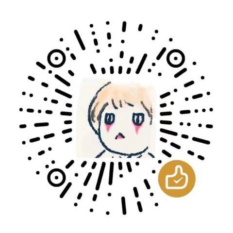

 

# emo - speed up android development

This repository contains series of libraries for android developers:

- ui-core: Contain some basic components such as TopBar, Loading, ... and some util methods.
- photo: To view/pick/clip pictures with Jetpack Compose.
- modal: A new way to implement Dialog，Toast, BottomSheet, ... with Jetpack Compose.
- more libraries are on the way.

# design principles

- Support API Level 24+.
- Based on JDK 11.
- All in Jetpack Compose.
- Use coroutines for concurrency and data flow.

# Download

```kts
// ui-core
implementation("cn.qhplus.emo:ui-core:0.0.1")
// photo
implementation("cn.qhplus.emo:photo-coil:0.0.2")
// modal
implementation("cn.qhplus.emo:modal:0.0.1")
```

# Demo apk

[Download apk](apk/emo.apk) or scan the qrcode below(pay attention to the wall):


==========================================================================


关注我的公众号，获取 emo 相关的技术解析：


给个赞赏，以资鼓励：

